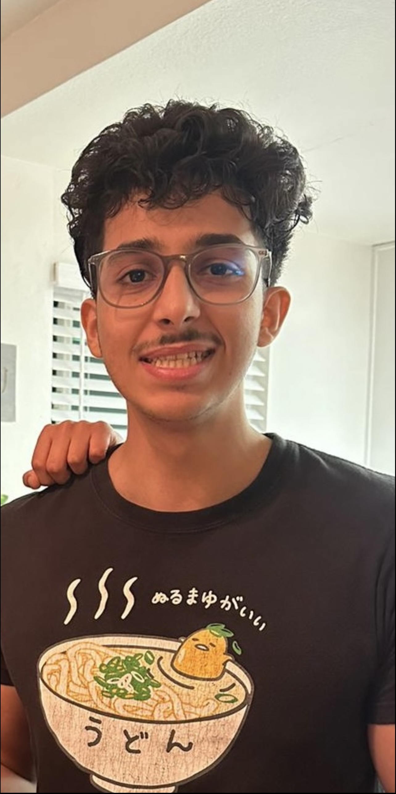

# Zeyad Almoaigel 

## Bio



A third year international Math-CS major at UCSD who's interested in AI. Originating from Saudi, I've always had a passion when it came to computers, whether it be software or hardware, so I grew up with computers *all around* me\. 
\
\
\
\
\
\
\
\
\
\
\
\
A quote I always remember when coding is the following\:


> “Simplicity, carried to the extreme, becomes elegance.”— Jon Franklin

Currently working in the [Mathematical Neuroscience Lab](http://www.silva.ucsd.edu/) at UCSD

- [X] Working hard
- [ ] Happy

## Programming experience

- Interened at Yaqeen capital and worked on cyber security and system networking, 2023
- Interened at KSU as a front-end developer, 2018

### Programming languages I'm profiecicent in (ordered)

1. Python
2. Java
3. C++
4. C
5. HTML
6. CSS

**Fun fact:** you can commit and add at the same time by doing ```git commit -a```\.

[Click me to see my smile again](IMG_2930.jpeg)